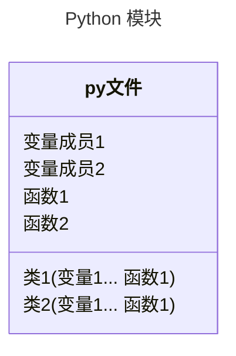

 # P11. Python 模块

[文档地址](https://github.com/walter201230/Python/blob/master/Article/PythonBasis/python9/Preface.md)

> 在 Python 中，一个 .py 文件就称之为一个模块（Module）。





## 1.导入模块

> import

```python
# 导入模块
import math

print(math.pi)
```

### 导入模块原理

> python 根据一系列目录名进行路径搜索,搜索路径是在 python 编译或者安装的时候进行 

```python
import math
# 直接导入模块的类和方法: from modname import name1[, name2[, ... nameN]]
from sys import version

print(math.pi)
print(version)
```

### 主模块和非主模块

> 当一个模块被外部调用的时候, 他就是非主模块\
> 一个模块没有被任何外部模块调用的时候, 他就是主模块

### name 属性

> 使用 `__name__` 属性判断是否主模块, 也就是所谓的 main 函数

```python
if __name__ == '__main__':
    print("is main module")
```

### 使用 _xxx 来表示是内部变量

[下一章: P12. 魔法函数](../p12-megic-function/README.md)

[上一章: P10. 面向对象](../p10-object/README.md)
